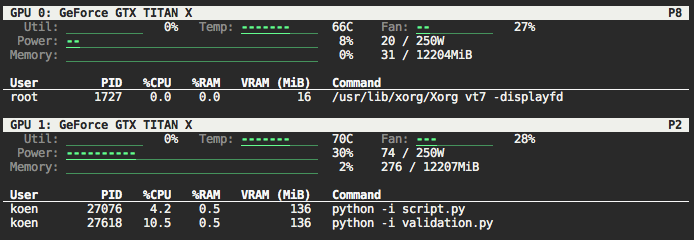

# `nvtop`
Equivalent of the Linux `top` command for NVIDIA GPUs.

## Dependencies
Requires the NVIDIA drivers and specifically the `nvidia-smi` command to run.  `nvtop` makes system calls to `nvidia-smi` and the `ps` command.

## Options
`nvtop` has three command line options:

* `nvtop -h` or `nvtop --help` displays this text;
* `nvtop -c` or `nvtop --compact` makes the view more compact by leaving out the graphs;
* `nvtop -g=X` only shows the tables for GPUs in the list X, e.g. nvtop -g=1 only shows GPU 1, nvtop -g=1,2 shows GPUs 1 and 2

The latter two options can be mixed i.e. `nvtop -c -g=1,2,3` shows compact tables for GPUs 1, 2, and 3.

## What do the colors mean?
The graphs are green when there is low usage, and turn red when they are more than 80% full.
The processes are blue when they are associated with your user name, which helps to distinguish scripts and programs run by yourself.

## Screenshots

